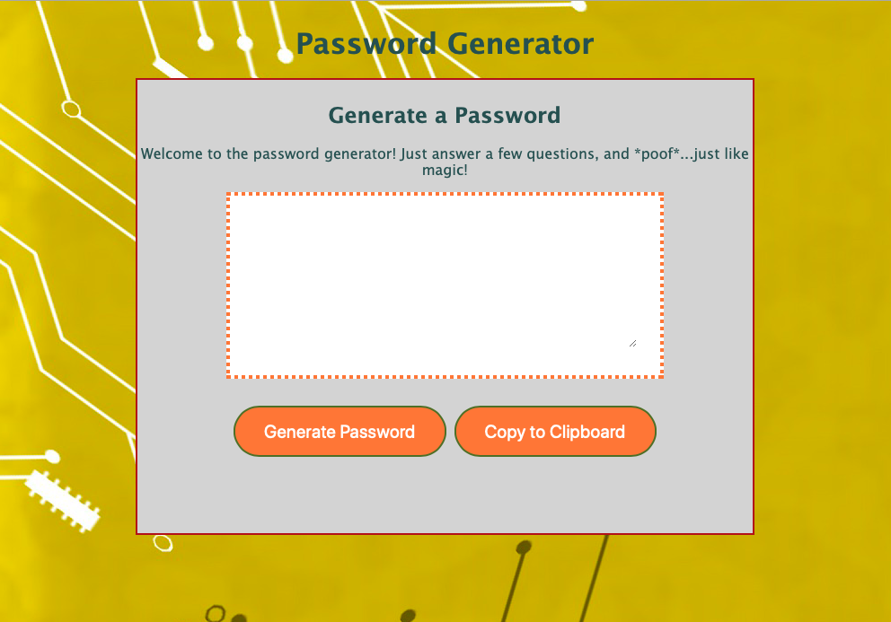
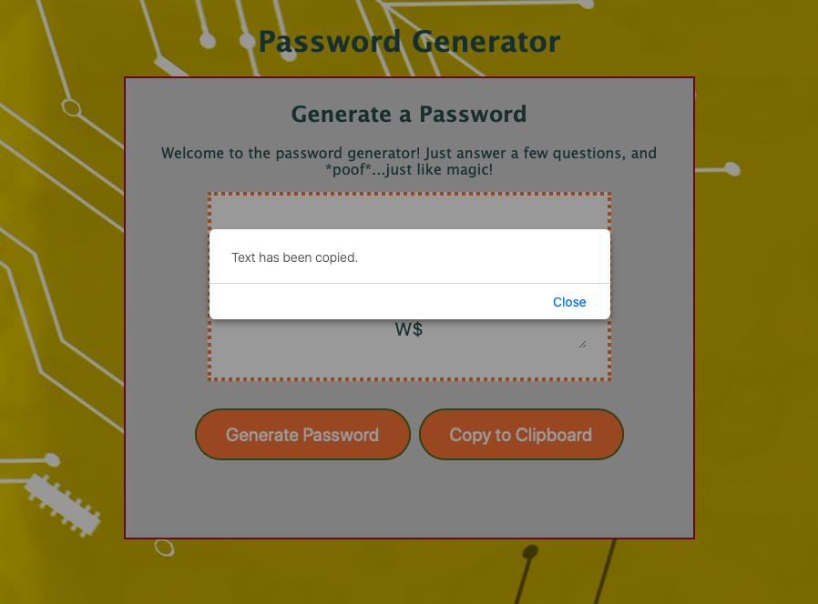

Password Generator

This is a website that allows the user to generate a random password after giving a few details regarding the type of password they would like.

Those details include:
-Password length
-Inclusion of upper and/or lowercase letters
-Inclusion of numbers
-Inclusion of special characters

The steps for this project were to gather information from the user, generate a password from that information, show that generated password to the user, and provide a Copy to Clipboard function for ease-of-use.

In this project, I focused on trying to make the mobile view look good and making sure the Copy to Clipboard function works as intended.

While the mobile styling could use some work, I was very pleased with the overall look and performance of this website.  It's very clear and easy to use, and gives the user freedom to dictate the details of their password.